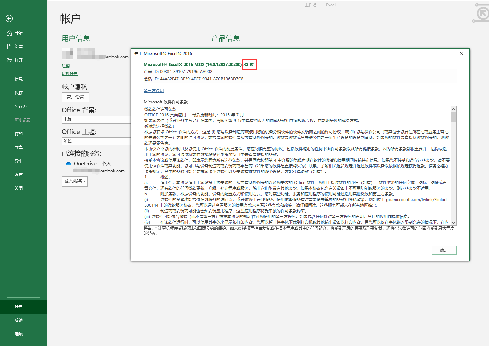
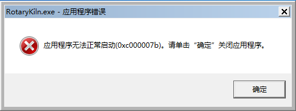

# 回转窑RotaryKiln软件安装激活步骤

## 安装

1. 选择目标位置

  

2. 执行安装

  

3. 安装Microsoft Visual C++ 2015 Redistributable (x86) 运行库

  

  

4. 注意：请检查电脑安装的Office版本

  - 系统未安装Office，则需要执行安装目录下（默认C:\Program Files (x86)\RotaryKiln）Engine_install.bat;
  - 系统安装了Office-x64，则需要执行安装目录下（默认C:\Program Files (x86)\RotaryKiln）Engine_install_passive.bat;
  - 系统安装了Office-x86，则不需要安装额外驱动。

  

- 如何检测Office是x64还是x86？

可在Excel中，点击【文件】→【账户】→【关于Excel】看到。

- 如何安装驱动？

请执行对应的批处理文件，步骤如下

  

  

  

  

  

  

5. 安装完成

  

## 激活

执行软件，复制机器注册窗口中的本机序列号，将对应的注册码填入并确定即完成注册。

## 问题

1. 

  此问题时由于Microsoft Visual C++ 2015 Redistributable (x86) 运行库未安装导致的，请执行安装目录下的vc_redist.x86.exe来修复问题。

2. 

  此问题是由于缺少可用的32位Access驱动，请参照安装步骤4来安装驱动程序。

3. 

  此问题是由于数据库丢失或与配置文件路径不一致，配置文件application.cfg的DatabasePath保存着数据库路径（默认db/RotaryKiln.accdb），请移动数据库文件或修改配置文件以保持一致，如果数据库文件丢失，可以备份文件后重新安装软件，并用备份文件覆盖安装目录。

